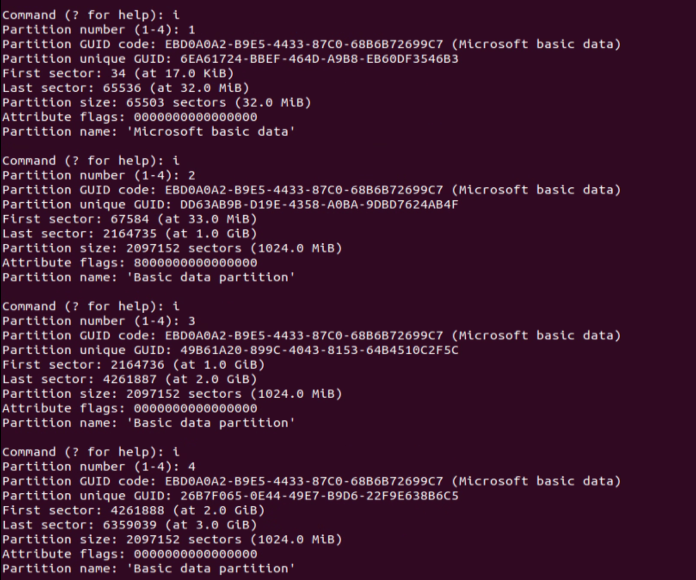

# FireMarshal


First, set up Chipyard following this tutorial. When running the `./build-setup.sh` command, omit the skip for step 8 and 9, and do the following instead:

```bash
$chipyard/build-setup.sh riscv-tools -s 6 -s 7 
```


[setting-up-chipyard-on-ubuntu.md](../chipyard/setting-up-chipyard/setting-up-chipyard-on-ubuntu.md)



## Building for QEMU

```bash
cd $chipyard/software/firemarshal/
```

```bash
sudo chmod +r /boot/vmlinuz-*
```

[https://askubuntu.com/questions/1046828/how-to-run-libguestfs-tools-tools-such-as-virt-make-fs-without-sudo](https://askubuntu.com/questions/1046828/how-to-run-libguestfs-tools-tools-such-as-virt-make-fs-without-sudo)


```bash
cd $chipyard/
source ./env.sh
cd $chipyard/software/firemarshal/
```


```bash
./init-submodules.sh
```


build the thing

```bash
./marshal build br-base.json
```


launch in QEMU

```bash
./marshal launch br-base.json
```


## Building for vcu118

```bash
cd $chipyard/software/firemarshal/
```


edit `$chipyard/software/firemarshal/marshal-config.yaml` to have the following content

```yaml
firesim-dir: "../../sims/firesim/"
board-dir: "boards/prototype/"
```


## Running build

```bash
./marshal -v -d build br-base.json
```

here the `-d` indicates `--nodisk` or initramfs

<figure><figcaption></figcaption></figure>


## Generating binary

```bash
./marshal -v -d install -t prototype br-base.json
```

<figure><figcaption></figcaption></figure>


## Creating SD Card

See the following link to create SD card.


[creating-sd-card-for-linux-bootup.md](creating-sd-card-for-linux-bootup.md)



Use the following command to copy Linux image into SD card. Replace `sdx` with the actual sd card path

```bash
sudo dd if=$chipyard/software/firemarshal/images/prototype/br-base/br-base-bin-nodisk-flat of=/dev/sdx1
```

<figure><figcaption></figcaption></figure>


## Notes

Buildroot Linux on Firemarshal does not have good support for password login. If running into issues such as the system does not recognize the login password, remove the password in the configuration file by doing the following:

Edit `software/firemarshal/boards/prototype/base-workloads/br-base/buildroot-config` , remove the line setting the password.

```bash
...
BR2_RISCV_ABI_LP64D=y
BR2_ARCH_IS_64=y

# remove the password
# BR2_TARGET_GENERIC_ROOT_PASSWD="fpga"

BR2_GENERATE_LOCALE=""
BR2_PACKAGE_E2FSPROGS=y
...
```

Build the system again, and now the Linux should not ask for password when logging into root.

<figure><figcaption></figcaption></figure>


To clean the previous build, run

```bash
./marshal -v clean br-base.json
```

