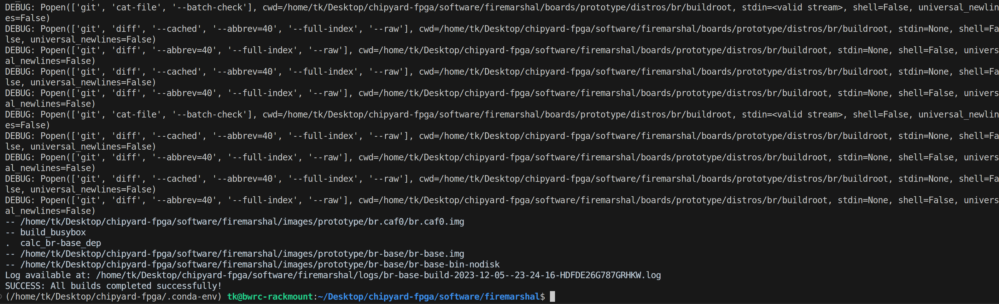

# Universal Asynchronous Receiver/Transmitter (UART)

## Introduction

The UART offers a flexible means to perform Full-duplex data exchange with external devices. A very wide range of baud rates can be achieved through a fractional baud rate generator. The UART peripheral does not support hardware flow control or other modem control signals, or synchronous serial data transfers.

## UART main features

* Full-duplex asynchronous communication
* Baud rate generator systems
* 16× Rx oversampling with 2/3 majority voting per bit
* Two internal FIFOs for transmit and receive data with programmable watermark interrupts
* A common programmable transmit and receive baud rate
* Configurable stop bits (1 or 2 stop bits)
* Separate enable bits for transmitter and receiver
* Interrupt sources with flags

## UART functional description

### UART signals

UART bidirectional communications require two pins: Receive Data In (RX) and Transmit Data Out (TX):&#x20;

#### RX (Receive Data Input)

RX is the serial data input. Oversampling techniques are used for data recovery. They discriminate between valid incoming data and noise. Commonly, RX is color-coded as <mark style="color:green;">green</mark>.&#x20;

#### TX (Transmit Data Output)

When the transmitter is enabled and no data needs to be transmitted, the TX pin is High. Commonly, RX is color-coded as <mark style="color:yellow;">yellow</mark>.&#x20;

The signal (TX or RX) is in low state during the start bit. It is in high state during the stop bit.

Transmission and reception are driven by a common baud rate generator.

### UART FIFOs and watermark

The USART comes with a Transmit FIFO (TXFIFO) and a Receive FIFO (RXFIFO).&#x20;

It is possible to configure the TXFIFO and RXFIFO levels at which the Tx and RX interrupts are triggered. These thresholds are programmed through TXCNT in TXCTRL control register and RXCNT bitfields in RXCTRL control register.

In this case:

* When the number of received data in the RXFIFO is strictly greater than the count specified by the RXCNT bits fields, and the RXWM is set in the IE register, the corresponding interrupt is generated. The interrupt bit is cleared when sufficient entries have been dequeued to fall below the watermark.&#x20;

This means that the RXFIFO is filled until the number of data in the RXFIFO is equal to the programmed threshold.&#x20;

As an example, when the RXCNT is programmed to ‘111’, the RXFT flag is set when a number of data corresponding to the FIFO size has been received.&#x20;

* When the number of pending data in the TXFIFO is strictly less than the count specified by the TXCNT bits fields, and the TXWM is set in the IE register, the corresponding interrupt is generated. The interrupt bit is cleared when sufficient entries have been enqueued to exceed the watermark

This means that the TXFIFO is emptied until the number of empty locations in the TXFIFO is equal to the programmed threshold.&#x20;

\

## UART registers

### Transmit data register (TXDATA)

Address offset: `0x00`

Reset value: `0x0000_0000`\

<figure><figcaption></figcaption></figure>

<table data-full-width="true"><thead><tr><th width="98">Bits</th><th width="159">Name</th><th>Description</th></tr></thead><tbody><tr><td>31</td><td>FULL</td><td>
Transmit FIFO full flag.

This bit is read-only. 

The FULL flag indicates whether the transmit FIFO is able to accept new entries. When full, writes to data are ignored.

0: TX FIFO is not full

1: TX FIFO is full
</td></tr><tr><td>7:0</td><td>DATA</td><td>
Data field.

These bits are write-only. When written, puts the value into TX FIFO. When read, the bits will always be zero.

These bits are set and cleared by software.
</td></tr></tbody></table>

### Receive data register (RXDATA)

Address offset: `0x04`

Reset value: `0x0000_0000`

<figure><figcaption></figcaption></figure>

<table data-full-width="true"><thead><tr><th width="98">Bits</th><th width="159">Name</th><th>Description</th></tr></thead><tbody><tr><td>31</td><td>EMPTY</td><td>
Receive FIFO empty flag.

This bit is read-only. The EMPTY flag indicates whether the reception FIFO is able to accept new entries. 

0: RX FIFO is not empty

1: RX FIFO is empty
</td></tr><tr><td>7:0</td><td>DATA</td><td>
Data field.

These bits are read-only. Reading from this register will automatically deque one entry from the RX FIFO.
</td></tr></tbody></table>

### Transmit control register (TXCTRL)

Address offset: `0x08`

Reset value: `0x0000_0000`

<figure><figcaption></figcaption></figure>

<table data-full-width="true"><thead><tr><th width="98">Bits</th><th width="159">Name</th><th>Description</th></tr></thead><tbody><tr><td>18:16</td><td>TXCNT</td><td>
Transmit FIFO watermark trigger.

These bits are read-and-write. These bits specify the threshold at which the TX FIFO watermark interrupt triggers.
</td></tr><tr><td>1</td><td>NSTOP</td><td>
Stop bit configuration.

This bit is read-and-write.

0: one stop bit

1: two stop bits
</td></tr><tr><td>0</td><td>TXEN</td><td>
Transmission enable control.

This bit is read-and-write.

0: TX disabled

1: TX enabled
</td></tr></tbody></table>

### Receive control register (RXCTRL)

Address offset: `0x0C`

Reset value: `0x0000_0000`

<figure><figcaption></figcaption></figure>

<table data-full-width="true"><thead><tr><th width="98">Bits</th><th width="159">Name</th><th>Description</th></tr></thead><tbody><tr><td>18:16</td><td>RXCNT</td><td>
Receive FIFO watermark trigger.

These bits are read-and-write. These bits specify the threshold at which the RX FIFO watermark interrupt triggers.
</td></tr><tr><td>0</td><td>RXEN</td><td>
Reception enable control.

This bit is read-and-write.

0: RX disabled

1: RX enabled
</td></tr></tbody></table>

